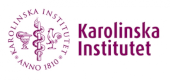
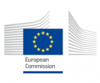
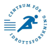

## Copyrights
MetaMEx content and code are published under the Creative Commons Attribution-NonCommercial 4.0 International [CC BY-NC 4.0.](https://creativecommons.org/licenses/by-nc/4.0/ "Creative Commons Attribution-NonCommercial 4.0 International")

## Citation
If you use data from MetaMEx for publication, teaching or scientific presentations, please cite: <a href="https://doi.org/10.1038/s41467-019-13869-w" target="_blank">Nicolas J. Pillon, Brendan M. Gabriel, Lucile Dollet, Jonathon A. Smith, Laura Sardon Puig, Javier Botella, David J. Bishop,Anna Krook and Juleen R. Zierath. Transcriptomic Profiling of Skeletal Muscle Adaptations to Exercise and Inactivity. Nat Commun. 2020; 11:470.</a>

## Credits
*	**Programming:** <a href="https://nicopillon.com/contact" target="_blank">Nicolas J. Pillon</a>
* **Beta testing and scientific feedback:** Brendan M. Gabriel, Lucile Dollet, Jonathon A. Smith, Laura Sardon Puig, Anna Krook and <a href="https://staff.ki.se/people/julzie" target="_blank">Juleen R. Zierath</a>
* **Web server:** <a href="https://www.nbis.se/about/staff/nanjiang-shu/" target="_blank">Nanjiang Shu</a>
from the National Bioinformatics Infrastructure Sweden (<a href="https://nbis.se/" target="_blank">NBIS</a>)
* **Illustration and design:** <a href="http://misshue.net" target="_blank">Csil</a>
* **Published datasets:** from all our colleagues acknowledged in the publication and dataset tables. MetaMEx is a live database regularly updated with new data. MetaMEx becomes stronger with every bit of data we add. If you have information about clinical data or want us to add your study to the database, [contact us!](<mailto:nicolas.pillon@ki.se?subject=Hyperlinks>)

## Funding
This work was supported by the Marie Sklodowska-Curie Actions (European Commission), the Novo Nordisk Foundation, the Swedish Diabetes Foundation, the Swedish Research Council, the Strategic Research Program in Diabetes at Karolinska Institutet, the Stockholm County Council, the Swedish Research Council for Sport Science and the EFSD European Research Programme on New Targets for Type 2 Diabetes supported by an educational research grant from MSD.

