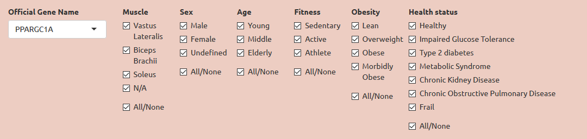
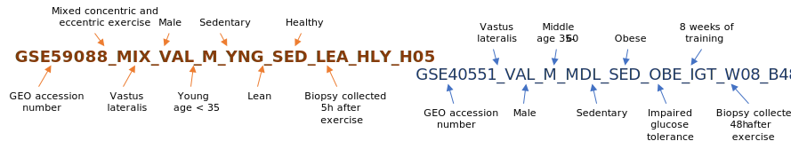
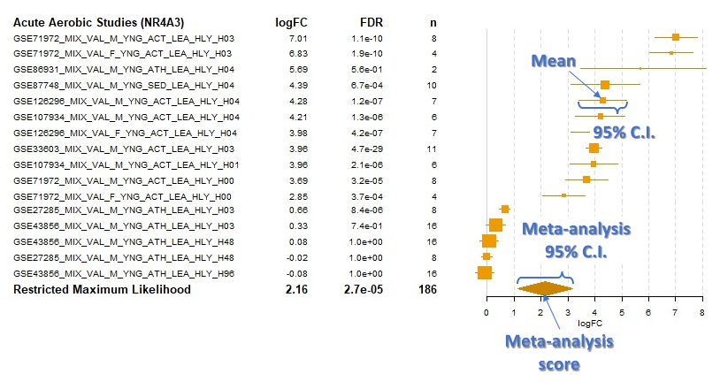

# Welcome to MetaMEx
The online database of skeletal muscle transcriptomic response to exercise and inactivity. On this website, you will be able to explore how specific genes respond to acute exercise, exercise training and inactivity. **Let’s start!**

## How do I select my gene and population of interest?

MetaMEx works with official gene symbols, for instance here, the official gene name of PGC1α is PPARGC1A. MetaMEx compiles more than 90 studies performed under slighlty different conditions. So first, have a look at the following lists:

*	**Muscle.** Most studies do cycling exercise and therefore collect vastus lateralis (quadriceps) biopsies. However, a handful of studies used soleus or biceps biosies. Sometimes the muscle biopsy is unknow and is therefore annotated as N.A. 
*	**Sex.** Choose whether you want males (M) or females (F). Some studies have pooled males and females or did not provide sex information and are labelled as undefined (U).
*	**Age.** Studies in MetaMEx are split into three age groups: young (<35), middle age (35-60) and elderly (>60).
*	**Fitness**. Activity levels were determined based on the description of the cohorts available in the publications. Sedentary is defined as no formal exercise training. Individuals performing exercise for more than 150 min per week and/or having an average VO2max are considered active. Athletes are individuals engaged in formal and regular exercise training and exhibit good to excellent VO2max.
*	**Obesity.** Body composition is based on body mass index provided in the publications and the actual definition of lean (BMI<25), overweight (25≤BMI<30), obese (30≤BMI<40) and morbidly obese (BMI≥40).
*	**Health.** MetaMEx includes studies from healthy individuals with no history of disease as well as people diagnosed with metabolic diseases or other chronic conditions such as chronic kidney disease or frailty.
* **Acute exercise studies.** MetaMEx processes aerobic and resistance studies separately. For both exercise protocols, it is possibly to customize the type of exercise (concentric, eccentric or mixed) and the time of the biopsy collection after exercise cessation. It is also possible to include/exclude specific studies based on their GEO accession number.
* **Exercise training studies.** MetaMEx processes aerobic and resistance studies separately. For both exercise protocols, it is possibly to customize the duration of the training (from 1 week to lifelong) and the time of the biopsy collection after exercise cessation. It is also possible to include/exclude specific studies based on their GEO accession number.
* **Inactivity studies.** MetaMEx includes two inactivity protocols: bed rest or limb immobilization. It is also possible to customize the duration of the inactivity and include/exclude specific studies based on their GEO accession number.

## Why do studies have such a complicated name?

All studies were annotated with as much information as possible about age, weight, health, biopsy, muscle, etc. The title of the studies reflect the clinical data and protocol used for a specific study. See Datasets>Annotation for a detailled description of the labels.

## What does a forest plot represent?

The left-hand columns list the names of the studies, followed by the fold-change (log2), false discovery rate (FDR) and sample size (n) for each individual study. The right-hand column is a plot of the fold-change (log2) represented by a square and the 95% confidence intervals represented by horizontal lines. The area of each square is proportional to the study's weight (sample size) in the meta-analysis. The overall meta-analysed score is represented by a diamond on the bottom line, the lateral points of which indicate confidence intervals.

## Why are some genes not available in all studies?

Old arrays, or custom arrays often have a limited number of detected genes. For instance, the GSE7286 dataset only includes data for about 1000 genes. On the other hand, the more recent RNA sequencing datasets often have more than 20.000 genes. In order to give a transparent overview of the currently available data, all studies are presented, even if genes are not detected.

## Why is FDR different from what is reported in the original publications?

Whenever possible, we downloaded the raw data and re-processed studies using the same pipeline. That means that the normalization methods that we used might differ from the ones used by the original authors. In addition, samples were often insufficiently annotated to allow us to run proper paired-statistics comparing pre/post interventions. We therefore had to used unpaired statistics and lost power in the process. Finally, many studies pooled individuals of different age and BMI to have higher sample size. To allow proper comparison in the meta-analysis, we split these studies into sub groups and analyzed them separately, therefore reducing the sample size and statistical power.

## What statistical methods were used?

The meta-analysis was created by collecting publicly available studies on mRNA expression levels in human skeletal muscle after exercise or inactivity. Statistics were first perfomed individually for each array. 
* Robust multiarray averaging was used for affymetrix arrays (oligo package)
* Quantile normalization was used for other microarrays (limma package)
* Variance stabilizing transformation (VST) was used for RNA sequencing datasets (DESeq2 package). 
* Moderated t-statistics were calculated for each  study with empirical bayes statistics for differential expression (limma package). Fold-change, confidence intervals, standard deviation and averages pre/post interventions are downloadable in the Download section of the website.

The meta-analysis summary was calculated using restricted maximum likelihood (metafor package). The analysis was weighted using sample size (n) to adjust for studies with small number of volunteers.
